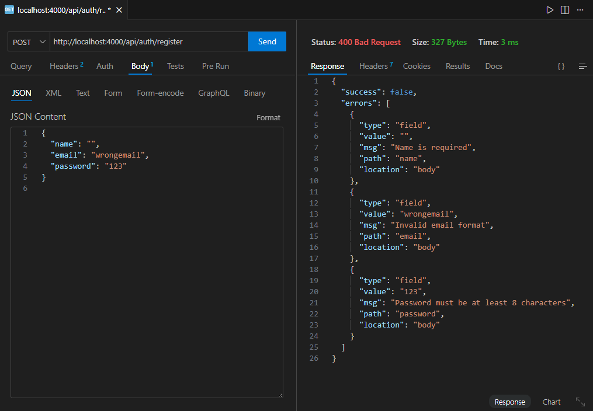

Backend Authentication API
Description

This project is a Backend Authentication API built using Node.js, Express.js, and MongoDB as part of a machine test.
It implements secure user registration, login, and protected profile access using JWT authentication with proper request validation.

Features

User registration with input validation

User login with JWT token generation

Password hashing using bcrypt

Protected route accessible only with valid JWT

Centralized error handling

Structured JSON API responses

Tech Stack

Node.js

Express.js

MongoDB (Mongoose)

JWT Authentication

Express Validator

API Endpoints

POST /api/auth/register – Register new user

POST /api/auth/login – Login and get JWT token

GET /api/user/profile – Protected user profile route

API Testing

All APIs were tested using Postman / Thunder Client.
Screenshots are available in the postman-tests/ folder.

Environment Variables
PORT=4000
MONGO_URI=your_mongodb_connection_string
JWT_SECRET=your_secret_key

